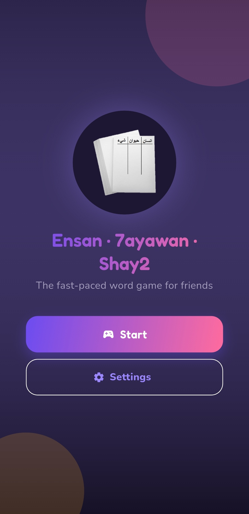
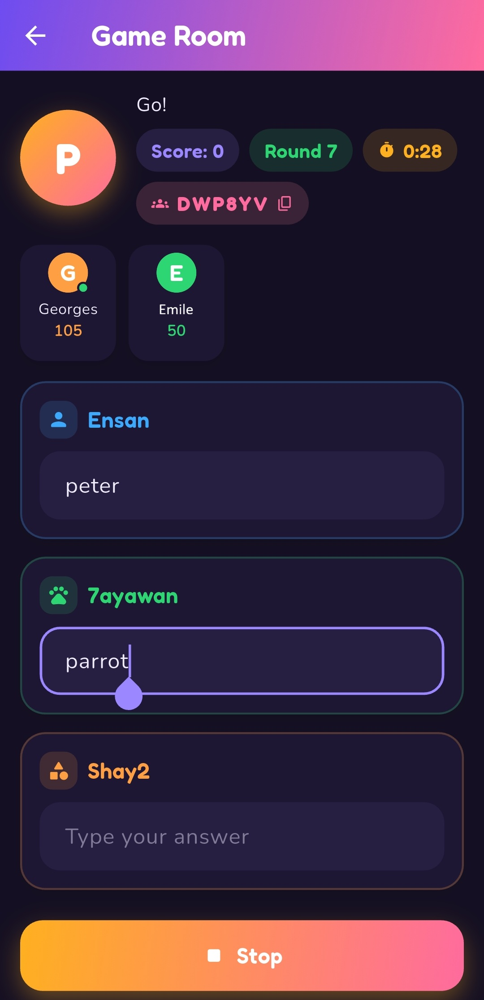

# Ensan 7ayawan Shay2 (انسان حيوان شيء)

A real-time multiplayer word game: pick a random letter, then race to name a
person/character, an animal, and a thing that all start with it. Players
self-score each round and compare totals live.

A Flutter rewrite of the original native Android app, targeting **Android
and Web**.

  
  

## Features

- Email/password or Google sign-in
- Create a room and share a short invite code, or join one with a code
- Live multiplayer rounds with a synced timer and rounds-played counter
- Presence indicator for who's currently online
- Light/dark theme

## Stack

- Flutter + Riverpod (state) + go_router (routing)
- Firebase: Authentication, Firestore, Realtime Database (presence)

## Setup

Nothing Firebase-specific is committed. Bring your own project(s):

- `flutterfire configure` → `lib/firebase_options_dev.dart` and
  `_prod.dart` (dev vs. release build, see `lib/main.dart`)
- Copy `firebase.json.example` → `firebase.json` and
  `android/key.properties.example` → `android/key.properties`, fill in
  your own values

## Status

Core gameplay is complete: auth, create/join rooms, live rounds, settings.

## Contributing

Contributions are welcome. See [CONTRIBUTING.md](CONTRIBUTING.md) for how to get set
up and submit a change.

## License

[MIT](LICENSE)
